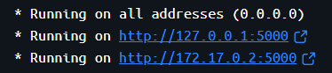
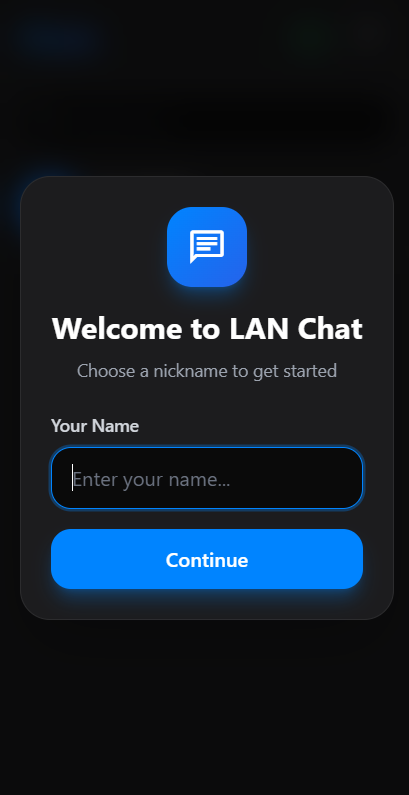
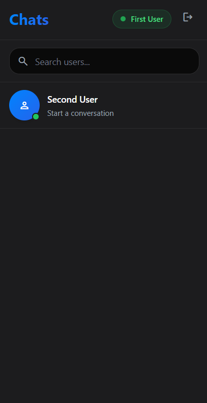
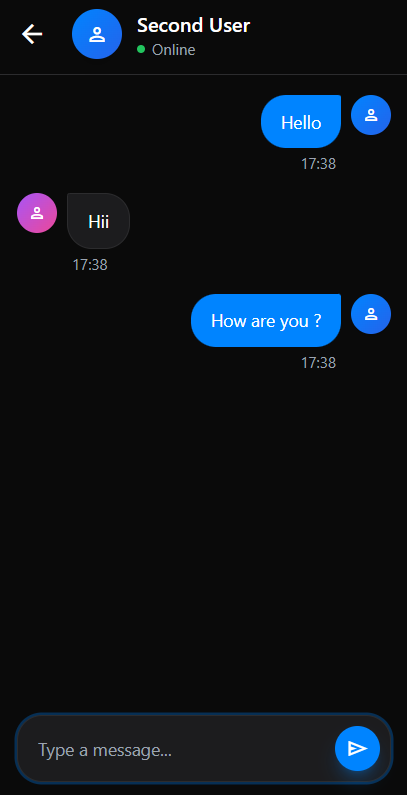
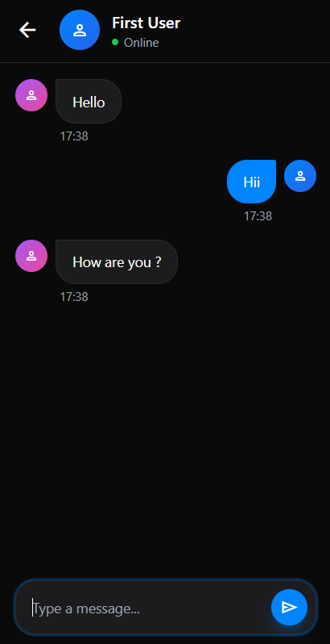
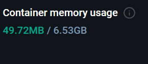
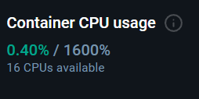

# LAN Chat
<p align="center">
  
  
  
</p>

A robust, real-time local network chat application built with Python and Flask. Designed for seamless communication within a local environment, featuring persistent sessions and instant messaging capabilities.

## Features

- **Real-Time Messaging**: Instant message delivery using WebSocket (Flask-SocketIO).
- **Persistent Sessions**: Users stay logged in across page refreshes and browser restarts (up to 30 days).
- **Auto-Login**: Intelligent session management automatically restores your username.
- **Private Messaging**: Support for direct 1-on-1 conversations.
- **Typing Indicators**: See when other users are typing.
- **Live User List**: Real-time updates of who is currently online.
- **Docker Ready**: Fully containerized for easy deployment.

## Connecting from Other Devices

To chat with others or connect from your phone, devices must be on the same Wi-Fi or Local Area Network (LAN).

1.  Find the **Local IP Address** of the computer running the server (e.g., `192.168.1.11`).
2.  On your other device (Phone/Laptop), open a browser and enter that IP with the port `.5000`.
    *   **Example:** `http://192.168.1.11:5000`


*Reference for finding your server URLs to share with other devices.*

## Gallery

### Application Preview



### Performance Monitoring




## Getting Started

You can run LAN Chat using Docker (recommended) or directly with Python.

### Option 1: Docker (Recommended)

Ensure you have Docker installed on your machine.

**For Windows:**
Simply double-click `run.bat` or run it from the command line:
```batch
.\run.bat
```

**For Linux/macOS:**
Make the script executable and run it:
```bash
chmod +x run.sh
./run.sh
```

These scripts will load the docker image (if present as `lan-chat.tar`) and start the container on port 5000.

### Option 2: Manual Python Installation

1.  **Install Application Dependencies:**
    ```bash
    pip install -r requirements.txt
    ```

2.  **Run the Application:**
    ```bash
    python main.py
    ```

3.  **Access the Chat:**
    Open your browser and navigate to `http://localhost:5000` (or your machine's IP address on the LAN).

## Technologies

- **Backend**: Python 3.9+, Flask
- **Real-time Engine**: Flask-SocketIO
- **Frontend**: HTML5, CSS3, JavaScript
- **Containerization**: Docker
